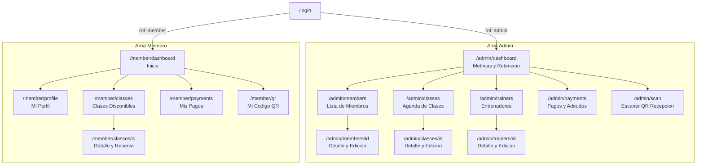
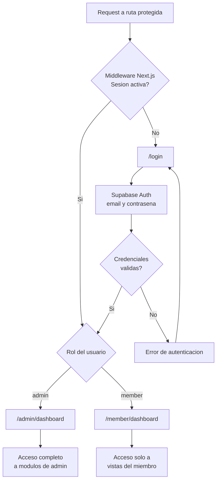
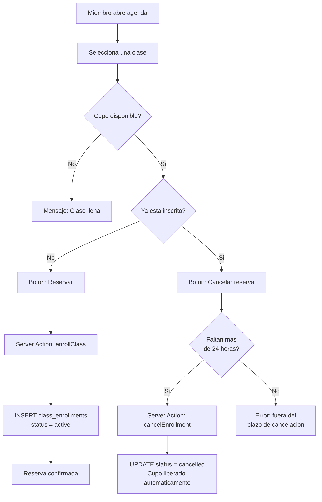
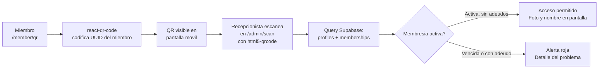

# Gym Power CDMX — Product Requirements Document (V4)

## 1. Resumen Ejecutivo y Objetivos

- **Propósito:** Desarrollar un MVP funcional para la gestión operativa y financiera del gimnasio Gym Power CDMX, con acceso diferenciado para administradores y miembros.
- **Problema a Resolver:** La administración fragmentada de membresías, el control ineficiente de cupos en clases grupales, la ausencia de visibilidad sobre la retención de miembros, los adeudos y la disponibilidad de entrenadores.
- **Métrica de Éxito Primaria:** Sistema estable, 100% funcional y desplegado públicamente antes de las 6:00 PM del día de entrega, con UX profesional y responsivo en todos los dispositivos.

---

## 2. Roles y Permisos

| Capacidad                               | Admin | Miembro |
|-----------------------------------------|:-----:|:-------:|
| CRUD de miembros                        | ✅    | ❌      |
| Ver y editar perfil propio              | ✅    | ✅      |
| CRUD de clases grupales                 | ✅    | ❌      |
| Reservar / cancelar asistencia a clase  | ✅    | ✅      |
| CRUD de entrenadores                    | ✅    | ❌      |
| Ver perfil de entrenadores              | ✅    | ✅      |
| Registrar pagos y adeudos               | ✅    | ❌      |
| Ver historial de pagos propio           | ✅    | ✅      |
| Dashboard analítico de retención        | ✅    | ❌      |
| Ver y mostrar QR de acceso              | ✅    | ✅      |
| Escanear / validar QR en recepción      | ✅    | ❌      |

**Implementación en Supabase:** Roles manejados vía `user_metadata` en Supabase Auth. Las políticas de Row Level Security (RLS) en PostgreSQL hacen cumplir estos permisos a nivel de base de datos, independientemente de la UI.

---

## 3. Historias de Usuario Principales (User Stories)

- **Admin — Miembros:** Como admin, quiero registrar, editar y dar de baja miembros asignándoles un plan, fecha de inicio y fecha de vencimiento para tener control exacto del estado de cada membresía.
- **Admin — Finanzas:** Como admin, quiero registrar pagos manuales y consultar el historial de adeudos para mantener un control preciso del flujo de caja.
- **Admin — Entrenadores:** Como admin, quiero gestionar los perfiles de entrenadores con su especialidad y disponibilidad semanal para asignarlos correctamente a las clases grupales.
- **Admin — Reportes:** Como admin, quiero generar reportes de retención filtrando por rangos de fechas para medir el crecimiento mensual del gimnasio.
- **Admin — Recepción:** Como admin/recepcionista, quiero escanear el QR del miembro en la entrada para validar su acceso en segundos sin consultar listas en papel.
- **Miembro — Clases:** Como miembro, quiero reservar o cancelar mi asistencia a una clase grupal con al menos 24 horas de anticipación para gestionar mi agenda sin perder mi lugar.
- **Miembro — Perfil:** Como miembro, quiero ver mi plan activo, mis próximas clases y mi historial de pagos desde mi portal para estar al tanto de mi situación en el gimnasio.
- **Miembro — QR:** Como miembro, quiero mostrar mi código QR desde el móvil para acceder al gimnasio sin necesidad de cargar credencial física.
- **Evaluador ReWo:** Como evaluador, quiero ingresar al sistema con credenciales demo preconfiguradas para probar el flujo completo de admin y de miembro sin registrar datos desde cero.

---

## 4. Requisitos Funcionales (Core Scope)

### 4.1 Módulo de Miembros (CRM — Vista Admin)
- CRUD completo de miembros: nombre, teléfono, correo, foto (almacenada en Supabase Storage) y plan asignado.
- Fecha de inicio y fecha de vencimiento de membresía por miembro.
- Indicador visual de estado: **Activo**, **Por vencer** (≤7 días) y **Vencido**.

### 4.2 Portal del Miembro (Vista Miembro)
- Vista de perfil propio: datos personales, plan activo y fechas de membresía.
- Sección de clases: próximas clases inscritas y agenda disponible con opción de reserva.
- Historial de pagos y saldo pendiente propios.
- Acceso al QR de identificación personal.

### 4.3 Módulo de Clases Grupales
- Agenda visual de clases con nombre, horario, cupo máximo, cupos restantes y entrenador asignado.
- Inscripción de miembros a clases con validación de cupo en tiempo real.
- Cancelación de inscripción con liberación automática del cupo, únicamente dentro de la ventana de 24 horas previas a la clase. La validación se ejecuta en un Server Action de Next.js comparando `class_datetime - NOW() > 24h` antes de modificar la base de datos.
- Bloqueo de cancelaciones fuera de la ventana permitida con mensaje de error claro.

### 4.4 Módulo de Entrenadores
- CRUD de entrenadores: nombre, especialidad (ej. yoga, crossfit, spinning), bio corta, foto (Supabase Storage) y disponibilidad semanal por día y bloque horario.
- La disponibilidad se almacena como filas en la tabla `trainer_availability` (`trainer_id`, `day_of_week`, `start_time`, `end_time`).
- Vista de perfil individual del entrenador con sus clases asignadas.
- Filtro por disponibilidad al asignar un entrenador al crear o editar una clase.

### 4.5 Módulo de Finanzas (Pagos Recurrentes)
- Historial de pagos por miembro: fecha, monto, concepto y estado (pagado / pendiente).
- Registro manual de pagos y adeudos desde el dashboard del administrador.
- Indicador de saldo pendiente visible tanto en el panel admin como en el portal del miembro.

### 4.6 Dashboard Analítico — Retención de Miembros
- Panel con métricas clave: total de miembros activos, nuevas altas, bajas y tasa de retención en el período seleccionado.
- Fórmula de retención: `((miembros_fin - nuevas_altas) / miembros_inicio) × 100`.
- Selector dinámico de rango de fechas (fecha inicio / fecha fin) para filtrar el reporte.
- Visualización gráfica (chart de línea o barras) del comportamiento mensual.

### 4.7 Aportación Extra — Check-in QR
1. **Qué se implementa:** Generación de un código QR único e intransferible por miembro y una vista de validación para recepción.
2. **Por qué es útil comercialmente:** Elimina las listas de asistencia en papel, reduce los tiempos de espera en la entrada, previene el uso de membresías ajenas y digitaliza por completo el control de acceso.
3. **Cómo se implementa:**
   - El QR se genera en el frontend con `react-qr-code` codificando el UUID del miembro (Supabase `auth.users.id`).
   - El miembro lo muestra desde su portal en móvil (`/member/qr`).
   - El recepcionista accede a `/admin/scan`, escanea el QR con la cámara del dispositivo usando `html5-qrcode` (inicializado en `useEffect` por su API no-React), y el sistema consulta el perfil del miembro en Supabase mostrando en pantalla: nombre, foto, estado de membresía y adeudos pendientes.
   - Si la membresía está vencida o tiene adeudos, se muestra una alerta visual en rojo.

---

## 5. Mapa de Pantallas y Flujos de Usuario

### 5.1 Mapa de Navegación

Todas las rutas de la aplicación y su jerarquía, separadas por rol. Los formularios de creación (new) se acceden mediante botones dentro de cada vista de lista.

---

### 5.2 Flujo de Autenticación y Routing por Rol

El middleware de Next.js (`middleware.ts`) intercepta cada request y consulta la sesión de Supabase para redirigir según el rol. Rutas `/admin/*` son exclusivas para admins; rutas `/member/*` para miembros.

---

### 5.3 Flujo de Reserva y Cancelación de Clase

La regla de 24 horas se valida exclusivamente en el Server Action antes de escribir en base de datos, no a nivel de UI.

---

### 5.4 Flujo del Check-in QR

---

## 6. Diseño Responsivo Multi-dispositivo

- **Enfoque:** 100% mobile-first. El diseño se construye desde el breakpoint más pequeño hacia arriba.
- **Framework de estilos:** Tailwind CSS (utilidades de grid y flexbox nativas).
- **Breakpoints obligatorios:**
  - Mobile: < 768px (base)
  - Tablet: ≥ 768px
  - Desktop: ≥ 1200px
- **Interacción táctil:** Botones y elementos interactivos con área mínima de toque de 44×44px. Sin dependencia de `hover` para funcionalidad crítica.
- **PWA (entregable confirmado):** `manifest.json` + Service Worker vía `@serwist/next` (sucesor de `next-pwa`, diseñado para el App Router de Next.js) para soporte offline básico, instalabilidad y comportamiento de app nativa.

---

## 7. Fuera del Alcance (Out of Scope)

- Integración con pasarelas de pago de terceros (Stripe, PayPal, MercadoPago).
- Notificaciones push automatizadas o correos transaccionales.
- Aplicación móvil nativa empaquetada para iOS App Store o Google Play.
- Sistema de notificaciones en tiempo real (Supabase Realtime no incluido en el MVP).

---

## 8. Arquitectura Técnica y Entorno

### 8.1 Core del Stack

- **Lenguaje:** TypeScript en todo el proyecto. Tipos de base de datos auto-generados con `supabase gen types typescript`.
- **Frontend:** Next.js App Router con Tailwind CSS. Server Components por defecto; Client Components solo donde se requiere interactividad. Lógica de mutación en Server Actions.
- **Autenticación:** Supabase Auth con `@supabase/ssr`. Sesiones en cookies. Middleware de Next.js (`middleware.ts`) para protección de rutas por rol.
- **Base de Datos:** Supabase PostgreSQL con RLS habilitado en todas las tablas (ver `docs/SCHEMA.md`).
- **Almacenamiento:** Supabase Storage — bucket `avatars` privado con URLs firmadas.
- **Infraestructura:** Docker + Dokploy en VPS privado.
- **Versionamiento:** Git público, commits convencionales (`feat:`, `fix:`, `chore:`).

### 8.2 Stack de Librerías

| Propósito | Librería | Justificación |
|---|---|---|
| Componentes UI base | `shadcn/ui` | Componentes instalables (Calendar, DataTable, Cards, Tabs) con estética enterprise y cero CSS extra. |
| Dashboard / KPIs | `Tremor` | Librería de componentes para dashboards sobre Tailwind (KPI cards, donut charts, progress bars). Copia y pega al estilo shadcn. |
| Gráfico de retención | `Recharts` | Alternativa ligera si Tremor resulta excesivo; solo gráfico de líneas. |
| Formularios | `React Hook Form` | No re-renderiza en cada pulsación; rendimiento óptimo para formularios complejos. |
| Validación | `Zod` | Un schema compartido para validar en cliente (errores en tiempo real) y en Server Actions (integridad de datos). |
| Generación QR | `react-qr-code` | Basada en SVG — escalable, nítida en cualquier resolución móvil y descargable como imagen. |
| Escaneo QR | `html5-qrcode` | Motor más robusto para escaneo desde navegador; soporta múltiples cámaras y funciona en condiciones de poca luz. Inicializado en `useEffect`. |
| PWA | `@serwist/next` | Sucesor de `next-pwa`, compatible con el App Router. Maneja caching de rutas de Next.js automáticamente. |

### 8.3 Seed Data (Datos Demo)

Script `/scripts/seed.ts` que pre-popula la base de datos al desplegar:
- 1 admin: `demo@gympowercdmx.mx` / `DemoPower2026!`
- 1 miembro: `miembro@gympowercdmx.mx` / `MiembroPower2026!`
- 10 miembros adicionales con distintos estados de membresía (activo, por vencer, vencido).
- 4 entrenadores con especialidades y disponibilidad semanal.
- 8 clases grupales con cupos variados e inscripciones mixtas.
- 20 registros de pagos (pagados y pendientes) para poblar el historial y el dashboard.

---

## 9. Entregables y Restricciones

- **URL pública del sistema** con las siguientes credenciales demo preconfiguradas:
  - Admin → `demo@gympowercdmx.mx` / `DemoPower2026!`
  - Miembro → `miembro@gympowercdmx.mx` / `MiembroPower2026!`
- **Repositorio Git público** con historia completa de commits funcionales.
- **`README.md`** detallando: arquitectura del proyecto, estructura de carpetas, tablas y relaciones de la base de datos, instrucciones de setup local (incluyendo cómo correr el seed) y decisiones técnicas justificadas.
- **Video Loom #1 — Demo funcional** (máx. 5 min): flujo completo desde ambos roles (admin y miembro), cubriendo los 5 módulos core + PWA + Check-in QR.
- **Video Loom #2 — Detrás de escenas** (máx. 5 min): decisiones técnicas, desafíos superados, uso de IA y justificación de la aportación extra (Check-in QR) con sus tres puntos: qué, por qué comercialmente, cómo.
- **Aportación extra documentada** en README y video técnico.
