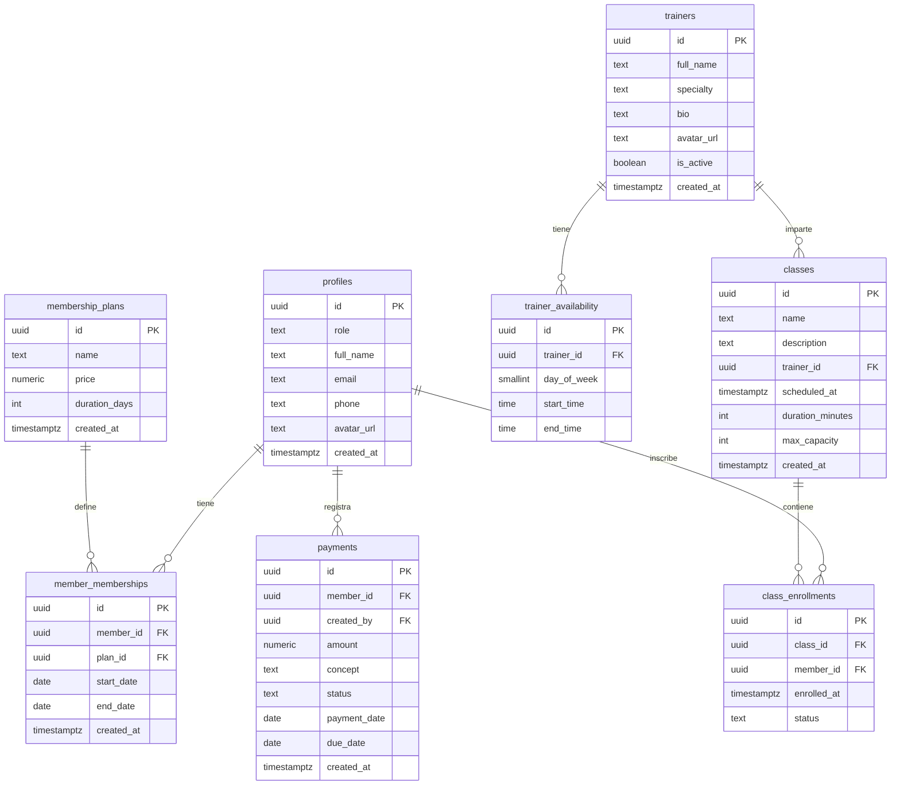

# Gym Power CDMX — Schema de Base de Datos (Supabase / PostgreSQL)

## Diagrama de Entidades



---

## Tablas

### `profiles`
Extiende `auth.users` de Supabase. Se crea automáticamente vía trigger al registrar un usuario.

```sql
CREATE TABLE public.profiles (
  id          UUID PRIMARY KEY REFERENCES auth.users(id) ON DELETE CASCADE,
  role        TEXT NOT NULL DEFAULT 'member' CHECK (role IN ('admin', 'member')),
  full_name   TEXT NOT NULL,
  email       TEXT NOT NULL,
  phone       TEXT,
  avatar_url  TEXT,
  created_at  TIMESTAMPTZ NOT NULL DEFAULT NOW()
);
```

> `email` se duplica desde `auth.users` porque la tabla `auth.users` no es accesible via RLS para usuarios normales. Guardarlo en `profiles` permite que el admin liste miembros con su correo sin necesitar privilegios especiales.

**Trigger de creación automática:**
```sql
CREATE OR REPLACE FUNCTION public.handle_new_user()
RETURNS TRIGGER AS $$
BEGIN
  INSERT INTO public.profiles (id, full_name, email, role)
  VALUES (
    NEW.id,
    COALESCE(NEW.raw_user_meta_data->>'full_name', NEW.email),
    NEW.email,
    COALESCE(NEW.raw_user_meta_data->>'role', 'member')
  );
  RETURN NEW;
END;
$$ LANGUAGE plpgsql SECURITY DEFINER;

CREATE TRIGGER on_auth_user_created
  AFTER INSERT ON auth.users
  FOR EACH ROW EXECUTE FUNCTION public.handle_new_user();
```

---

### `membership_plans`
Catálogo de planes disponibles en el gimnasio. Gestionado únicamente por el admin.

```sql
CREATE TABLE public.membership_plans (
  id            UUID PRIMARY KEY DEFAULT gen_random_uuid(),
  name          TEXT NOT NULL,
  price         NUMERIC(10,2) NOT NULL CHECK (price >= 0),
  duration_days INT NOT NULL CHECK (duration_days > 0),
  created_at    TIMESTAMPTZ NOT NULL DEFAULT NOW()
);
```

**Datos iniciales (seed):**

| name | price | duration_days |
|---|---|---|
| Mensual | 599.00 | 30 |
| Trimestral | 1599.00 | 90 |
| Anual | 5499.00 | 365 |

---

### `member_memberships`
Historial de membresías asignadas a cada miembro. Un miembro puede tener múltiples registros (renovaciones).

```sql
CREATE TABLE public.member_memberships (
  id          UUID PRIMARY KEY DEFAULT gen_random_uuid(),
  member_id   UUID NOT NULL REFERENCES public.profiles(id) ON DELETE CASCADE,
  plan_id     UUID NOT NULL REFERENCES public.membership_plans(id) ON DELETE RESTRICT,
  start_date  DATE NOT NULL,
  end_date    DATE NOT NULL,
  created_at  TIMESTAMPTZ NOT NULL DEFAULT NOW(),
  CHECK (end_date > start_date)
);
```

**Estado calculado en query (sin columna extra):**
```sql
-- En el SELECT del frontend:
CASE
  WHEN end_date < CURRENT_DATE               THEN 'expired'
  WHEN end_date <= CURRENT_DATE + INTERVAL '7 days' THEN 'expiring_soon'
  ELSE 'active'
END AS status
```

---

### `trainers`
Catálogo de entrenadores del gimnasio.

```sql
CREATE TABLE public.trainers (
  id          UUID PRIMARY KEY DEFAULT gen_random_uuid(),
  full_name   TEXT NOT NULL,
  specialty   TEXT NOT NULL,
  bio         TEXT,
  avatar_url  TEXT,
  is_active   BOOLEAN NOT NULL DEFAULT TRUE,
  created_at  TIMESTAMPTZ NOT NULL DEFAULT NOW()
);
```

---

### `trainer_availability`
Disponibilidad semanal de cada entrenador. Una fila por bloque horario disponible.

```sql
CREATE TABLE public.trainer_availability (
  id          UUID PRIMARY KEY DEFAULT gen_random_uuid(),
  trainer_id  UUID NOT NULL REFERENCES public.trainers(id) ON DELETE CASCADE,
  day_of_week SMALLINT NOT NULL CHECK (day_of_week BETWEEN 0 AND 6),
  start_time  TIME NOT NULL,
  end_time    TIME NOT NULL,
  CHECK (end_time > start_time)
);
```

**Convención `day_of_week`:** 0 = Domingo, 1 = Lunes, 2 = Martes, 3 = Miércoles, 4 = Jueves, 5 = Viernes, 6 = Sábado.

---

### `classes`
Agenda de clases grupales programadas.

```sql
CREATE TABLE public.classes (
  id               UUID PRIMARY KEY DEFAULT gen_random_uuid(),
  name             TEXT NOT NULL,
  description      TEXT,
  trainer_id       UUID REFERENCES public.trainers(id) ON DELETE SET NULL,
  scheduled_at     TIMESTAMPTZ NOT NULL,
  duration_minutes INT NOT NULL DEFAULT 60 CHECK (duration_minutes > 0),
  max_capacity     INT NOT NULL CHECK (max_capacity > 0),
  created_at       TIMESTAMPTZ NOT NULL DEFAULT NOW()
);
```

**Cupos disponibles (calculado en query, no almacenado):**
```sql
max_capacity - COUNT(ce.id) FILTER (WHERE ce.status = 'active') AS available_spots
```

---

### `class_enrollments`
Inscripciones de miembros a clases grupales.

```sql
CREATE TABLE public.class_enrollments (
  id          UUID PRIMARY KEY DEFAULT gen_random_uuid(),
  class_id    UUID NOT NULL REFERENCES public.classes(id) ON DELETE CASCADE,
  member_id   UUID NOT NULL REFERENCES public.profiles(id) ON DELETE CASCADE,
  enrolled_at TIMESTAMPTZ NOT NULL DEFAULT NOW(),
  status      TEXT NOT NULL DEFAULT 'active' CHECK (status IN ('active', 'cancelled'))
);

-- Índice único PARCIAL: solo una inscripción activa por miembro por clase.
-- Se usa índice parcial en lugar de UNIQUE constraint de tabla para permitir
-- que un miembro pueda re-inscribirse después de haber cancelado.
CREATE UNIQUE INDEX idx_enrollments_one_active_per_member
  ON public.class_enrollments (class_id, member_id)
  WHERE status = 'active';
```

**Regla de cancelación (validada en Server Action, no en DB):**
La cancelación solo se permite si `class.scheduled_at - NOW() > INTERVAL '24 hours'`. El Server Action verifica esta condición antes de hacer UPDATE a `status = 'cancelled'`.

**Flujo de re-inscripción:**
Si ya existe una fila `(class_id, member_id)` con `status = 'cancelled'`, el Server Action hace `UPDATE ... SET status = 'active', enrolled_at = NOW()` en lugar de un nuevo INSERT, para mantener limpio el historial.

---

### `payments`
Registro de pagos y adeudos de los miembros.

```sql
CREATE TABLE public.payments (
  id           UUID PRIMARY KEY DEFAULT gen_random_uuid(),
  member_id    UUID NOT NULL REFERENCES public.profiles(id) ON DELETE RESTRICT,
  created_by   UUID REFERENCES public.profiles(id) ON DELETE SET NULL,
  amount       NUMERIC(10,2) NOT NULL CHECK (amount > 0),
  concept      TEXT NOT NULL,
  status       TEXT NOT NULL DEFAULT 'paid' CHECK (status IN ('paid', 'pending')),
  payment_date DATE,
  due_date     DATE,
  created_at   TIMESTAMPTZ NOT NULL DEFAULT NOW()
);
```

> `ON DELETE RESTRICT` en lugar de `CASCADE`: impide eliminar un miembro si tiene pagos registrados, preservando la integridad del historial financiero. Para dar de baja a un miembro con pagos, el admin debe primero archivar o reasignar sus registros, o implementar soft delete con una columna `deleted_at TIMESTAMPTZ` en `profiles`.

---

## Row Level Security (RLS)

### Helper function
Función auxiliar reutilizable en todas las políticas para verificar si el usuario autenticado es admin.

```sql
CREATE OR REPLACE FUNCTION public.is_admin()
RETURNS BOOLEAN AS $$
  SELECT EXISTS (
    SELECT 1 FROM public.profiles
    WHERE id = auth.uid() AND role = 'admin'
  );
$$ LANGUAGE sql STABLE SECURITY DEFINER;
```

### Políticas por tabla

#### `profiles`
```sql
ALTER TABLE public.profiles ENABLE ROW LEVEL SECURITY;

-- SELECT: cada miembro ve solo su perfil; admins ven todos
CREATE POLICY "profiles_select" ON public.profiles FOR SELECT
  USING (auth.uid() = id OR public.is_admin());

-- UPDATE: cada miembro edita solo su perfil; admins editan todos
CREATE POLICY "profiles_update" ON public.profiles FOR UPDATE
  USING (auth.uid() = id OR public.is_admin());

-- INSERT: no existe política explícita de forma intencional.
-- Con RLS habilitado sin política INSERT, ningún usuario puede insertar directamente.
-- La inserción ocurre únicamente a través del trigger handle_new_user(),
-- que corre con SECURITY DEFINER y bypasea RLS de forma segura.

CREATE POLICY "profiles_delete" ON public.profiles FOR DELETE
  USING (public.is_admin());
```

#### `membership_plans`
```sql
ALTER TABLE public.membership_plans ENABLE ROW LEVEL SECURITY;

CREATE POLICY "plans_select" ON public.membership_plans FOR SELECT
  USING (auth.role() = 'authenticated');

CREATE POLICY "plans_insert" ON public.membership_plans FOR INSERT
  WITH CHECK (public.is_admin());

CREATE POLICY "plans_update" ON public.membership_plans FOR UPDATE
  USING (public.is_admin());

CREATE POLICY "plans_delete" ON public.membership_plans FOR DELETE
  USING (public.is_admin());
```

#### `member_memberships`
```sql
ALTER TABLE public.member_memberships ENABLE ROW LEVEL SECURITY;

CREATE POLICY "memberships_select" ON public.member_memberships FOR SELECT
  USING (member_id = auth.uid() OR public.is_admin());

CREATE POLICY "memberships_insert" ON public.member_memberships FOR INSERT
  WITH CHECK (public.is_admin());

CREATE POLICY "memberships_update" ON public.member_memberships FOR UPDATE
  USING (public.is_admin());

CREATE POLICY "memberships_delete" ON public.member_memberships FOR DELETE
  USING (public.is_admin());
```

#### `trainers`
```sql
ALTER TABLE public.trainers ENABLE ROW LEVEL SECURITY;

CREATE POLICY "trainers_select" ON public.trainers FOR SELECT
  USING (auth.role() = 'authenticated');

CREATE POLICY "trainers_insert" ON public.trainers FOR INSERT
  WITH CHECK (public.is_admin());

CREATE POLICY "trainers_update" ON public.trainers FOR UPDATE
  USING (public.is_admin());

CREATE POLICY "trainers_delete" ON public.trainers FOR DELETE
  USING (public.is_admin());
```

#### `trainer_availability`
```sql
ALTER TABLE public.trainer_availability ENABLE ROW LEVEL SECURITY;

CREATE POLICY "availability_select" ON public.trainer_availability FOR SELECT
  USING (auth.role() = 'authenticated');

CREATE POLICY "availability_insert" ON public.trainer_availability FOR INSERT
  WITH CHECK (public.is_admin());

CREATE POLICY "availability_update" ON public.trainer_availability FOR UPDATE
  USING (public.is_admin());

CREATE POLICY "availability_delete" ON public.trainer_availability FOR DELETE
  USING (public.is_admin());
```

#### `classes`
```sql
ALTER TABLE public.classes ENABLE ROW LEVEL SECURITY;

CREATE POLICY "classes_select" ON public.classes FOR SELECT
  USING (auth.role() = 'authenticated');

CREATE POLICY "classes_insert" ON public.classes FOR INSERT
  WITH CHECK (public.is_admin());

CREATE POLICY "classes_update" ON public.classes FOR UPDATE
  USING (public.is_admin());

CREATE POLICY "classes_delete" ON public.classes FOR DELETE
  USING (public.is_admin());
```

#### `class_enrollments`
```sql
ALTER TABLE public.class_enrollments ENABLE ROW LEVEL SECURITY;

-- SELECT: miembro ve sus propias inscripciones; admin ve todas
CREATE POLICY "enrollments_select" ON public.class_enrollments FOR SELECT
  USING (member_id = auth.uid() OR public.is_admin());

-- INSERT: miembro se inscribe a sí mismo; admin inscribe a cualquiera
CREATE POLICY "enrollments_insert" ON public.class_enrollments FOR INSERT
  WITH CHECK (member_id = auth.uid() OR public.is_admin());

-- UPDATE: miembro cancela su propia inscripción (ventana 24h validada en Server Action); admin actualiza cualquiera
CREATE POLICY "enrollments_update" ON public.class_enrollments FOR UPDATE
  USING (member_id = auth.uid() OR public.is_admin());

-- DELETE: solo admin
CREATE POLICY "enrollments_delete" ON public.class_enrollments FOR DELETE
  USING (public.is_admin());
```

#### `payments`
```sql
ALTER TABLE public.payments ENABLE ROW LEVEL SECURITY;

CREATE POLICY "payments_select" ON public.payments FOR SELECT
  USING (member_id = auth.uid() OR public.is_admin());

CREATE POLICY "payments_insert" ON public.payments FOR INSERT
  WITH CHECK (public.is_admin());

CREATE POLICY "payments_update" ON public.payments FOR UPDATE
  USING (public.is_admin());

CREATE POLICY "payments_delete" ON public.payments FOR DELETE
  USING (public.is_admin());
```

---

## Resumen de Políticas RLS

| Tabla | SELECT | INSERT | UPDATE | DELETE |
|---|---|---|---|---|
| `profiles` | Propio o admin | Trigger de auth | Propio o admin | Admin |
| `membership_plans` | Autenticado | Admin | Admin | Admin |
| `member_memberships` | Propio o admin | Admin | Admin | Admin |
| `trainers` | Autenticado | Admin | Admin | Admin |
| `trainer_availability` | Autenticado | Admin | Admin | Admin |
| `classes` | Autenticado | Admin | Admin | Admin |
| `class_enrollments` | Propio o admin | Propio o admin | Propio o admin | Admin |
| `payments` | Propio o admin | Admin | Admin | Admin |

---

## Supabase Storage

### Bucket `avatars`
- **Tipo:** Privado (no acceso público directo)
- **Acceso:** URLs firmadas con expiración de 1 hora generadas desde el servidor

**Estructura de paths:**
```
avatars/
├── members/
│   └── {member_id}/avatar        (ej. avatars/members/uuid-123/avatar)
└── trainers/
    └── {trainer_id}/avatar       (ej. avatars/trainers/uuid-456/avatar)
```

**Políticas de Storage:**

Los avatares de miembros y entrenadores tienen reglas distintas porque los entrenadores no tienen cuenta en `auth.users`.

```sql
-- MIEMBROS: el propio miembro o un admin puede leer/subir/actualizar su avatar
-- Path: members/{member_id}/avatar → (storage.foldername(name))[2] = member_id
CREATE POLICY "member_avatars_select" ON storage.objects FOR SELECT
  USING (
    bucket_id = 'avatars'
    AND (storage.foldername(name))[1] = 'members'
    AND (
      auth.uid()::text = (storage.foldername(name))[2]
      OR public.is_admin()
    )
  );

CREATE POLICY "member_avatars_insert" ON storage.objects FOR INSERT
  WITH CHECK (
    bucket_id = 'avatars'
    AND (storage.foldername(name))[1] = 'members'
    AND (
      auth.uid()::text = (storage.foldername(name))[2]
      OR public.is_admin()
    )
  );

CREATE POLICY "member_avatars_update" ON storage.objects FOR UPDATE
  USING (
    bucket_id = 'avatars'
    AND (storage.foldername(name))[1] = 'members'
    AND (
      auth.uid()::text = (storage.foldername(name))[2]
      OR public.is_admin()
    )
  );

-- ENTRENADORES: solo admins pueden gestionar avatares de entrenadores
-- Los entrenadores no tienen cuenta en auth.users, no pueden subir su propia foto
CREATE POLICY "trainer_avatars_select" ON storage.objects FOR SELECT
  USING (
    bucket_id = 'avatars'
    AND (storage.foldername(name))[1] = 'trainers'
    AND public.is_admin()
  );

CREATE POLICY "trainer_avatars_insert" ON storage.objects FOR INSERT
  WITH CHECK (
    bucket_id = 'avatars'
    AND (storage.foldername(name))[1] = 'trainers'
    AND public.is_admin()
  );

CREATE POLICY "trainer_avatars_update" ON storage.objects FOR UPDATE
  USING (
    bucket_id = 'avatars'
    AND (storage.foldername(name))[1] = 'trainers'
    AND public.is_admin()
  );
```

---

## Índices

```sql
-- Agenda de clases por fecha (dashboard y filtros)
CREATE INDEX idx_classes_scheduled_at ON public.classes (scheduled_at);

-- Clases inscritas por un miembro (historial completo)
CREATE INDEX idx_enrollments_member_id ON public.class_enrollments (member_id);

-- Roster de una clase específica
CREATE INDEX idx_enrollments_class_id ON public.class_enrollments (class_id);

-- Inscripciones activas por clase (para calcular cupos disponibles)
-- Nota: idx_enrollments_one_active_per_member (UNIQUE parcial WHERE status='active')
-- se define junto a la tabla class_enrollments y también sirve como índice de búsqueda.

-- Historial de pagos por miembro
CREATE INDEX idx_payments_member_id ON public.payments (member_id);

-- Membresía activa de un miembro (estado y vencimiento)
CREATE INDEX idx_memberships_member_end ON public.member_memberships (member_id, end_date);

-- Disponibilidad de entrenadores por día
CREATE INDEX idx_availability_trainer_day ON public.trainer_availability (trainer_id, day_of_week);

-- Búsqueda de miembros por email (filtro en panel admin)
CREATE INDEX idx_profiles_email ON public.profiles (email);
```

---

## Generación de Tipos TypeScript

Después de aplicar el schema en Supabase, ejecutar para generar los tipos automáticamente:

```bash
npx supabase gen types typescript --project-id <PROJECT_ID> --schema public > src/types/database.types.ts
```

Esto produce un archivo `database.types.ts` que refleja todas las tablas, columnas y relaciones, eliminando la necesidad de definir tipos manualmente.
